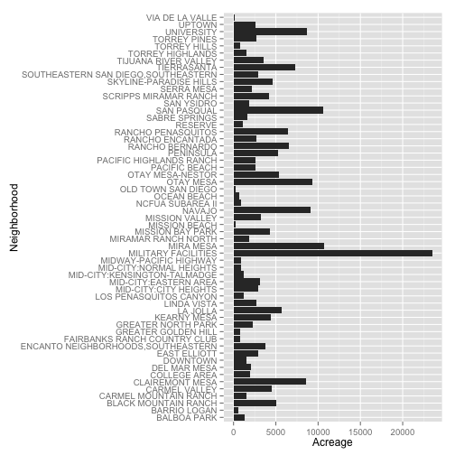

## Shiny Water Explorer Pitch 
### Maksim Pecherskiy
#### September 26, 2015

---

## Purpose
* Residents from different neighborhoods consume water in different amounts.
* Show where the top X% of water consumers are living.
* Show which neighborhoods consume the most water.


---

## Assumptions To Be Mitigated  
* Data used is a small sample.
* Not adjusted for multi-tenant buildings
* Not adjusted for businesses
* Areas differ in demographics and weather patterns - comparing **just** on consumptions is incomplete.
* Areas differ in acreage size (next slide)

---

## Area Acreages


```r
g <- ggplot(data = com_plan@data, aes(x = cpname, y = acreage)) +
          geom_bar(stat="identity") + coord_flip() + xlab("Neighborhood") +
          ylab("Acreage")
print(g)
```

 

---
## Next Steps
* Provide more controls for smarter analysis of water usage
* Filter for multi-tenant
* Filter for residential
* Bring in weather data
* Adjust for acreage of area


